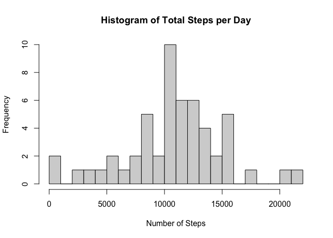
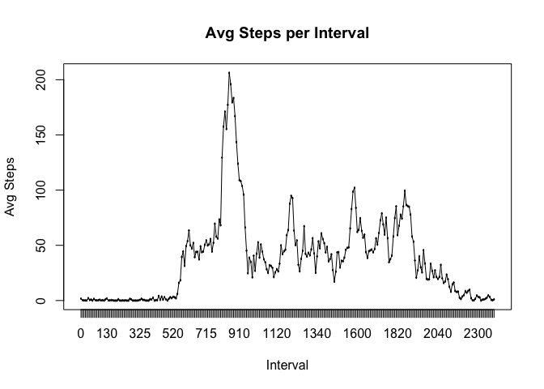
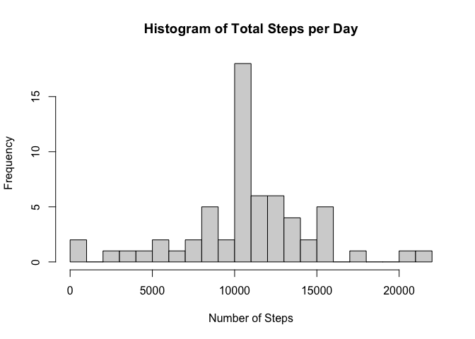
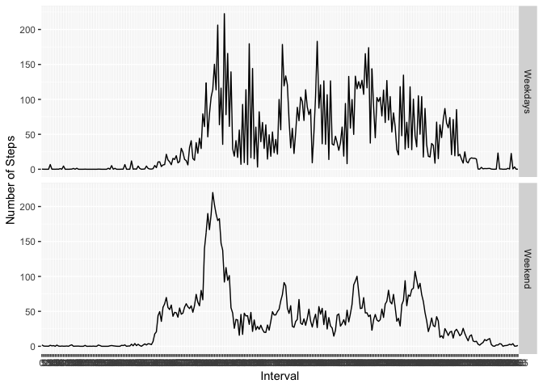

## Loading and preprocessing the data

```r
library(dplyr)
```

```
## 
## Attaching package: 'dplyr'
```

```
## The following objects are masked from 'package:stats':
## 
##     filter, lag
```

```
## The following objects are masked from 'package:base':
## 
##     intersect, setdiff, setequal, union
```

```r
library(ggplot2)
activity <- read.csv("./data/activity.csv")
activity$date <- as.Date(activity$date, "%Y-%m-%d")
activity$interval <- as.factor(activity$interval)
```
## What is mean total number of steps taken per day?

```r
totalSteps_day <- activity %>%
        filter(!is.na(steps)) %>%
        group_by(date) %>%
        summarise(sum = sum(steps))
```

```
## `summarise()` ungrouping output (override with `.groups` argument)
```

```r
hist(totalSteps_day$sum, breaks = 20, xlab = "Number of Steps", main = "Histogram of Total Steps per Day")
```

<!-- -->

```r
totalSteps_day_mean <- mean(totalSteps_day$sum)
print(totalSteps_day_mean)
```

```
## [1] 10766.19
```

```r
totalSteps_day_median <- median(totalSteps_day$sum)
print(totalSteps_day_median)
```

```
## [1] 10765
```
## What is the average daily activity pattern?

```r
avgSteps_day <- activity %>%
        filter(!is.na(steps)) %>%
        group_by(interval) %>%
        summarise(avg = mean(steps))
```

```
## `summarise()` ungrouping output (override with `.groups` argument)
```

```r
avgSteps_day <- as.data.frame(avgSteps_day)

plot(avgSteps_day$interval, avgSteps_day$avg, type = "l", xlab = "Interval", ylab = "Avg Steps", main = "Avg Steps per Interval")
lines(avgSteps_day$interval, avgSteps_day$avg)
```

<!-- -->

```r
maxSteps <- max(avgSteps_day$avg)
print(maxSteps)
```

```
## [1] 206.1698
```
## Imputing missing values

```r
isna <- activity %>%
        filter(is.na(steps)) %>%
        nrow()
print(isna)
```

```
## [1] 2304
```

```r
activity2 <- activity
for(interval in unique(activity2$interval)) {
        activity2[(is.na(activity2$steps) & activity2$interval == interval),]$steps <- avgSteps_day[avgSteps_day$interval == interval,]$avg
}
totalSteps_day2 <- activity2 %>%
        group_by(date) %>%
        summarise(sum = sum(steps))
```

```
## `summarise()` ungrouping output (override with `.groups` argument)
```

```r
hist(totalSteps_day2$sum, breaks = 20, xlab = "Number of Steps", main = "Histogram of Total Steps per Day")
```

<!-- -->

```r
totalSteps_day_mean2 <- mean(totalSteps_day2$sum)
print(totalSteps_day_mean2)
```

```
## [1] 10766.19
```

```r
totalSteps_day_median2 <- median(totalSteps_day2$sum)
print(totalSteps_day_median2)
```

```
## [1] 10766.19
```
#### Two dataset's mean and median are almost identical

## Are there differences in activity patterns between weekdays and weekends?

```r
activity2$day <- weekdays(activity2$date)
activity2$is_weekday <- ifelse(activity2$day == c("Saturday", "Sunday"), "Weekdays", "Weekend")

avgSteps_day2 <- activity2 %>%
        group_by(interval, is_weekday) %>%
        summarise(avg = mean(steps))
```

```
## `summarise()` regrouping output by 'interval' (override with `.groups` argument)
```

```r
g <- ggplot(avgSteps_day2, aes(interval, avg)) + geom_line(aes(group = 1)) + facet_grid(is_weekday~.) + ylab("Number of Steps") + xlab("Interval")
print(g)
```

<!-- -->


